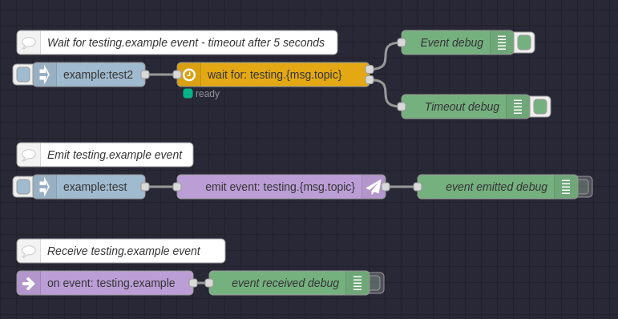

# node-red-contrib-event-listener

Emit, listen for, and wait on events using nodes in [Node-RED](https://nodered.org/)

I kept having these massive flows that would get really messy calling all over the place so the idea was to make something to help clean that up and make it much easier to understand what is happening from a glance. I tried using the built-in `link` nodes but the lack of labels made large flows still quite messy and hard to troubleshoot. This is meant to resolve that issue.

I spend a lot of time making these custom modules, if you use them consider donating:

### Usage Example

Above is a quick flow that demonstrates one of the use cases of these nodes.

If you fire an event into the first flow the `msg` will be held up until you either emit the event from the second flow (and it ends up at `Event debug` node) or timeout happens and the original `msg` is sent from the second output to the `Timeout debug` node.

We turn the debug nodes for the second and third flow off just so we only see messages make it throug the `wait for` node. You can easily turn these on to verify the whole process.

**Note:** If you press the inject button on the first flow 4 times then press the emit event button you will get 4 `msg` outputs to the first node. Currently we do not support changing this but if you need this feel free to open an issue to get it added.

To use this example import the JSON for this flow found [here](examples/example.json).

### Node Information

###### namespace node
This is the configuration node that every node uses. Events are grouped by a namespace to allow for organization and separation. 

###### emit event node

This node will emit (send) an event. You can choose to send the full `msg` object as the event payload (default option) or just a specific property.

###### on event node

This node listens for a specified `eventId` and outputs all events as `msg` objects. If the event data is not an object it will be set to a new `msg` object's `payload` and sent.

###### wait for node

Configuration `Timeout Handling` options:
- By default, when this node receives a `msg` it starts listening for an event matching the configured `eventId`. Once that event arrives it will stop listening and output the event details to the first output. If we receive no event by `timeout` we instead send the original message to the second output.
- If `Handling Timeout` option is set to `Send all events until timeout` then all the received events matching the configured `eventId` will be sent through until the timeout is reached then a timeout `msg` is sent from the second output.

Configuration `Event Data` options:
- **Set event data to msg property:** When an event arrives the event data will be set to the specified `msg`, `flow`, or `global` scope.
- **Merge events into original msg:** This only works if the event payload is an object. It will be merged into the original message overriding any existing keys in `msg` with keys from the event data.
- **Merge original msg into event:** The inverse of the above option. It will be merged into the event object overriding any existing keys in the event data object with keys & values from `msg`.
  - If event data is not an object the original payload is sent
- **Ignore event data:** The original waiting `msg` is let free without manipulation
  - If event data is not an object the original payload is sent

The `timeout` can be configured statically in configuration or set to be defined from a `msg`, `flow`, or `global` property.

### Other Packages

- [node-red-contrib-matrix-chat](https://www.npmjs.com/package/node-red-contrib-gamedig) - Matrix chat client for Node-RED
- [node-red-contrib-gamedig](https://www.npmjs.com/package/node-red-contrib-gamedig) - Query game/voice servers for information

### Developers
So far me (skylord123) is the only person that has contributed towards this package. Feel free to do any pull-requests to get your name here!

### License
This project is licensed under the MIT License. Check [here](LICENSE) for more information.
